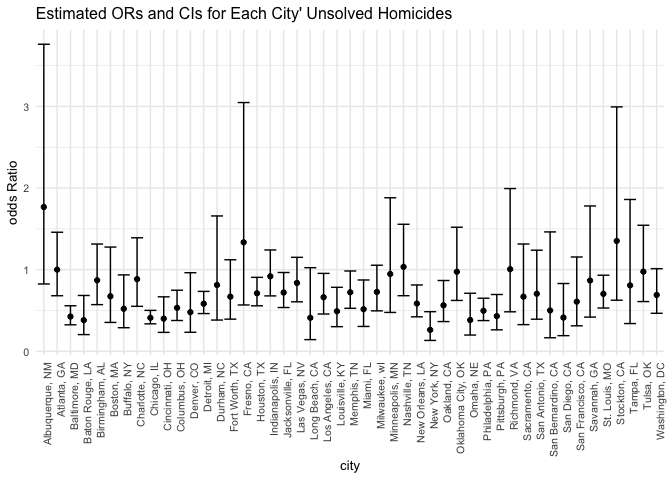

p8105_hw6_jm5509
================
Echo
2022-11-23

## Problem 1

Read the weather data:

``` r
weather_df = 
  rnoaa::meteo_pull_monitors(
    c("USW00094728"),
    var = c("PRCP", "TMIN", "TMAX"), 
    date_min = "2017-01-01",
    date_max = "2017-12-31") %>%
  mutate(
    name = recode(id, USW00094728 = "CentralPark_NY"),
    tmin = tmin / 10,
    tmax = tmax / 10) %>%
  select(name, id, everything())
```

    ## Registered S3 method overwritten by 'hoardr':
    ##   method           from
    ##   print.cache_info httr

    ## using cached file: ~/Library/Caches/R/noaa_ghcnd/USW00094728.dly

    ## date created (size, mb): 2022-09-29 22:32:40 (8.401)

    ## file min/max dates: 1869-01-01 / 2022-09-30

## Problem 2

First read the data:

``` r
homicides_df <- read.csv("https://raw.githubusercontent.com/washingtonpost/data-homicides/master/homicide-data.csv")
```

Then I created a `city_state` variable and a binary variable `resolved`
indicating whether the homicide is solved, and omit cities Dallas, TX;
Phoenix, AZ; and Kansas City, MO – these don’t report victim race. Also
omit Tulsa, AL – this is a data entry mistake. I also limit my analysis
those for whom `victim_race` is white or black. Be sure that
`victim_age` is numeric.

``` r
homicides_tb <-  homicides_df %>% 
  mutate(city_state = str_c(city, state, sep = ', '),
        resolved = as.numeric(disposition == 'Closed by arrest') ) %>% 
  filter(city_state !=  'Dallas, TX' & city_state != 'Phoenix, AZ' &
           city_state !=  'Kansas City, MO') %>% 
  filter(city_state != 'Tulsa, AL') %>% 
  filter(victim_race == 'White' | victim_race == 'Black') %>% 
  mutate(victim_age = as.numeric(victim_age),
         victim_race = fct_relevel(victim_race, 'White')) 
```

    ## Warning in mask$eval_all_mutate(quo): NAs introduced by coercion

For the city of Baltimore, MD, use the glm function to fit a logistic
regression with `resolved vs unresolved` as the outcome and
`victim age`, `sex` and `race` as predictors. Save the output of glm as
an R object; apply the broom::tidy to this object; and obtain the
estimate and confidence interval of the adjusted odds ratio for solving
homicides comparing male victims to female victims keeping all other
variables fixed.

``` r
bal_logistic <- homicides_tb %>% 
  filter(city_state == 'Baltimore, MD') %>% 
  glm(resolved ~ victim_age + victim_sex + victim_race, data = ., 
      family = binomial())

bal_logistic %>% 
  broom::tidy(conf.int = TRUE) %>% 
  mutate(OR = exp(estimate),
         conf_low_OR = exp(conf.low),
         conf_high_OR = exp(conf.high)) %>% 
  select(term, OR, conf_low_OR, conf_high_OR) %>% 
  filter(term == 'victim_sexMale') %>% 
  knitr::kable(digits = 3)
```

| term           |    OR | conf_low_OR | conf_high_OR |
|:---------------|------:|------------:|-------------:|
| victim_sexMale | 0.426 |       0.324 |        0.558 |

Now I run glm for each of the cities in dataset, and extract the
adjusted odds ratio (and CI) for solving homicides **comparing male
victims to female victims**. Do this within a “tidy” pipeline, making
use of purrr::map, list columns, and unnest as necessary to create a
dataframe with estimated ORs and CIs for each city.

``` r
all_cities <- homicides_tb %>% 
  group_by(city_state) %>% 
  nest() %>% 
  mutate(models = map(data, ~glm(resolved ~ victim_age + victim_sex + victim_race, data = ., family = binomial())),
         models = map(models, broom::tidy, conf.int = TRUE)) %>% 
  select(-data) %>% 
  unnest() %>% 
  mutate(OR = exp(estimate),
         conf_low_OR = exp(conf.low),
         conf_high_OR = exp(conf.high)) %>% 
  select(city_state, term, OR, conf_low_OR, conf_high_OR) %>% 
  filter(term == 'victim_sexMale') 
```

    ## Warning: glm.fit: fitted probabilities numerically 0 or 1 occurred

    ## Warning: glm.fit: fitted probabilities numerically 0 or 1 occurred

    ## Warning: glm.fit: fitted probabilities numerically 0 or 1 occurred

    ## Warning: glm.fit: fitted probabilities numerically 0 or 1 occurred

    ## Warning: glm.fit: fitted probabilities numerically 0 or 1 occurred

    ## Warning: glm.fit: fitted probabilities numerically 0 or 1 occurred

    ## Warning: glm.fit: fitted probabilities numerically 0 or 1 occurred

    ## Warning: glm.fit: fitted probabilities numerically 0 or 1 occurred

    ## Warning: glm.fit: fitted probabilities numerically 0 or 1 occurred

    ## Warning: glm.fit: fitted probabilities numerically 0 or 1 occurred

    ## Warning: glm.fit: fitted probabilities numerically 0 or 1 occurred

    ## Warning: glm.fit: fitted probabilities numerically 0 or 1 occurred

    ## Warning: glm.fit: fitted probabilities numerically 0 or 1 occurred

    ## Warning: glm.fit: fitted probabilities numerically 0 or 1 occurred

    ## Warning: glm.fit: fitted probabilities numerically 0 or 1 occurred

    ## Warning: glm.fit: fitted probabilities numerically 0 or 1 occurred

    ## Warning: glm.fit: fitted probabilities numerically 0 or 1 occurred

    ## Warning: glm.fit: fitted probabilities numerically 0 or 1 occurred

    ## Warning: glm.fit: fitted probabilities numerically 0 or 1 occurred

    ## Warning: glm.fit: fitted probabilities numerically 0 or 1 occurred

    ## Warning: glm.fit: fitted probabilities numerically 0 or 1 occurred

    ## Warning: glm.fit: fitted probabilities numerically 0 or 1 occurred

    ## Warning: glm.fit: fitted probabilities numerically 0 or 1 occurred

    ## Warning: glm.fit: fitted probabilities numerically 0 or 1 occurred

    ## Warning: glm.fit: fitted probabilities numerically 0 or 1 occurred

    ## Warning: glm.fit: fitted probabilities numerically 0 or 1 occurred

    ## Warning: glm.fit: fitted probabilities numerically 0 or 1 occurred

    ## Warning: glm.fit: fitted probabilities numerically 0 or 1 occurred

    ## Warning: glm.fit: fitted probabilities numerically 0 or 1 occurred

    ## Warning: glm.fit: fitted probabilities numerically 0 or 1 occurred

    ## Warning: glm.fit: fitted probabilities numerically 0 or 1 occurred

    ## Warning: glm.fit: fitted probabilities numerically 0 or 1 occurred

    ## Warning: glm.fit: fitted probabilities numerically 0 or 1 occurred

    ## Warning: glm.fit: fitted probabilities numerically 0 or 1 occurred

    ## Warning: glm.fit: fitted probabilities numerically 0 or 1 occurred

    ## Warning: glm.fit: fitted probabilities numerically 0 or 1 occurred

    ## Warning: glm.fit: fitted probabilities numerically 0 or 1 occurred

    ## Warning: glm.fit: fitted probabilities numerically 0 or 1 occurred

    ## Warning: glm.fit: fitted probabilities numerically 0 or 1 occurred

    ## Warning: glm.fit: fitted probabilities numerically 0 or 1 occurred

    ## Warning: glm.fit: fitted probabilities numerically 0 or 1 occurred

    ## Warning: glm.fit: fitted probabilities numerically 0 or 1 occurred

    ## Warning: glm.fit: fitted probabilities numerically 0 or 1 occurred

    ## Warning: `cols` is now required when using unnest().
    ## Please use `cols = c(models)`

``` r
all_cities %>% knitr::kable()
```

| city_state         | term           |        OR | conf_low_OR | conf_high_OR |
|:-------------------|:---------------|----------:|------------:|-------------:|
| Albuquerque, NM    | victim_sexMale | 1.7674995 |   0.8247081 |    3.7618600 |
| Atlanta, GA        | victim_sexMale | 1.0000771 |   0.6803477 |    1.4582575 |
| Baltimore, MD      | victim_sexMale | 0.4255117 |   0.3241908 |    0.5575508 |
| Baton Rouge, LA    | victim_sexMale | 0.3814393 |   0.2043481 |    0.6836343 |
| Birmingham, AL     | victim_sexMale | 0.8700153 |   0.5713814 |    1.3138409 |
| Boston, MA         | victim_sexMale | 0.6739912 |   0.3534469 |    1.2768225 |
| Buffalo, NY        | victim_sexMale | 0.5205704 |   0.2884416 |    0.9358300 |
| Charlotte, NC      | victim_sexMale | 0.8838976 |   0.5507440 |    1.3905954 |
| Chicago, IL        | victim_sexMale | 0.4100982 |   0.3361233 |    0.5008546 |
| Cincinnati, OH     | victim_sexMale | 0.3998277 |   0.2313767 |    0.6670456 |
| Columbus, OH       | victim_sexMale | 0.5324845 |   0.3770457 |    0.7479124 |
| Denver, CO         | victim_sexMale | 0.4790620 |   0.2327380 |    0.9624974 |
| Detroit, MI        | victim_sexMale | 0.5823472 |   0.4619454 |    0.7335458 |
| Durham, NC         | victim_sexMale | 0.8123514 |   0.3824420 |    1.6580169 |
| Fort Worth, TX     | victim_sexMale | 0.6689803 |   0.3935128 |    1.1211603 |
| Fresno, CA         | victim_sexMale | 1.3351647 |   0.5672553 |    3.0475080 |
| Houston, TX        | victim_sexMale | 0.7110264 |   0.5569844 |    0.9057376 |
| Indianapolis, IN   | victim_sexMale | 0.9187284 |   0.6784616 |    1.2413059 |
| Jacksonville, FL   | victim_sexMale | 0.7198144 |   0.5359236 |    0.9650986 |
| Las Vegas, NV      | victim_sexMale | 0.8373078 |   0.6058830 |    1.1510854 |
| Long Beach, CA     | victim_sexMale | 0.4102163 |   0.1427304 |    1.0241775 |
| Los Angeles, CA    | victim_sexMale | 0.6618816 |   0.4565014 |    0.9541036 |
| Louisville, KY     | victim_sexMale | 0.4905546 |   0.3014879 |    0.7836391 |
| Memphis, TN        | victim_sexMale | 0.7232194 |   0.5261210 |    0.9835973 |
| Miami, FL          | victim_sexMale | 0.5152379 |   0.3040214 |    0.8734480 |
| Milwaukee, wI      | victim_sexMale | 0.7271327 |   0.4951325 |    1.0542297 |
| Minneapolis, MN    | victim_sexMale | 0.9469587 |   0.4759016 |    1.8809745 |
| Nashville, TN      | victim_sexMale | 1.0342379 |   0.6807452 |    1.5559966 |
| New Orleans, LA    | victim_sexMale | 0.5849373 |   0.4218807 |    0.8121787 |
| New York, NY       | victim_sexMale | 0.2623978 |   0.1327512 |    0.4850117 |
| Oakland, CA        | victim_sexMale | 0.5630819 |   0.3637421 |    0.8671086 |
| Oklahoma City, OK  | victim_sexMale | 0.9740747 |   0.6228507 |    1.5199721 |
| Omaha, NE          | victim_sexMale | 0.3824861 |   0.1988357 |    0.7109316 |
| Philadelphia, PA   | victim_sexMale | 0.4962756 |   0.3760120 |    0.6498797 |
| Pittsburgh, PA     | victim_sexMale | 0.4307528 |   0.2626022 |    0.6955518 |
| Richmond, VA       | victim_sexMale | 1.0060520 |   0.4834671 |    1.9936248 |
| San Antonio, TX    | victim_sexMale | 0.7046200 |   0.3928179 |    1.2382509 |
| Sacramento, CA     | victim_sexMale | 0.6688418 |   0.3262733 |    1.3143888 |
| Savannah, GA       | victim_sexMale | 0.8669817 |   0.4185827 |    1.7802453 |
| San Bernardino, CA | victim_sexMale | 0.5003444 |   0.1655367 |    1.4623977 |
| San Diego, CA      | victim_sexMale | 0.4130248 |   0.1913527 |    0.8301847 |
| San Francisco, CA  | victim_sexMale | 0.6075362 |   0.3116925 |    1.1551470 |
| St. Louis, MO      | victim_sexMale | 0.7031665 |   0.5298505 |    0.9319005 |
| Stockton, CA       | victim_sexMale | 1.3517273 |   0.6256427 |    2.9941299 |
| Tampa, FL          | victim_sexMale | 0.8077029 |   0.3395253 |    1.8598834 |
| Tulsa, OK          | victim_sexMale | 0.9757694 |   0.6090664 |    1.5439356 |
| Washington, DC     | victim_sexMale | 0.6901713 |   0.4653608 |    1.0122516 |

``` r
all_cities %>% 
  mutate(city_state = fct_reorder(city_state, OR)) %>% 
  ggplot(aes(x = city_state, y = OR)) +
  geom_point() +
  geom_errorbar(aes(ymin = conf_low_OR, ymax = conf_high_OR)) +
  theme(text = element_text(size = 10),
          axis.text.x = element_text(angle = 90, hjust = 1)) +
  labs( x = 'city', y ='odds Ratio',
    title = 'Estimated ORs and CIs for Each City\' Unsolved Homicides'
  )
```

<!-- -->
