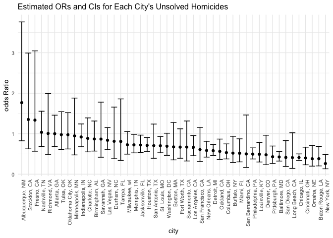

p8105_hw6_jm5509
================
Echo
2022-11-23

## Problem 1

Read the weather data:

``` r
weather_df = 
  rnoaa::meteo_pull_monitors(
    c("USW00094728"),
    var = c("PRCP", "TMIN", "TMAX"), 
    date_min = "2017-01-01",
    date_max = "2017-12-31") %>%
  mutate(
    name = recode(id, USW00094728 = "CentralPark_NY"),
    tmin = tmin / 10,
    tmax = tmax / 10) %>%
  select(name, id, everything())
```

    ## Registered S3 method overwritten by 'hoardr':
    ##   method           from
    ##   print.cache_info httr

    ## using cached file: ~/Library/Caches/R/noaa_ghcnd/USW00094728.dly

    ## date created (size, mb): 2022-09-29 22:32:40 (8.401)

    ## file min/max dates: 1869-01-01 / 2022-09-30

## Problem 2

First read the data:

``` r
homicides_df <- read.csv("https://raw.githubusercontent.com/washingtonpost/data-homicides/master/homicide-data.csv")
```

Then I created a `city_state` variable and a binary variable `resolved`
indicating whether the homicide is solved, and omit cities Dallas, TX;
Phoenix, AZ; and Kansas City, MO – these don’t report victim race. Also
omit Tulsa, AL – this is a data entry mistake. I also limit my analysis
those for whom `victim_race` is white or black. Be sure that
`victim_age` is numeric.

``` r
homicides_tb <-  homicides_df %>% 
  mutate(city_state = str_c(city, state, sep = ', '),
        resolved = as.numeric(disposition == 'Closed by arrest') ) %>% 
  filter(city_state !=  'Dallas, TX' & city_state != 'Phoenix, AZ' &
           city_state !=  'Kansas City, MO') %>% 
  filter(city_state != 'Tulsa, AL') %>% 
  filter(victim_race == 'White' | victim_race == 'Black') %>% 
  mutate(victim_age = as.numeric(victim_age),
         victim_race = fct_relevel(victim_race, 'White')) 
```

    ## Warning in mask$eval_all_mutate(quo): NAs introduced by coercion

For the city of Baltimore, MD, use the glm function to fit a logistic
regression with `resolved vs unresolved` as the outcome and
`victim age`, `sex` and `race` as predictors. Save the output of glm as
an R object; apply the broom::tidy to this object; and obtain the
estimate and confidence interval of the adjusted odds ratio for solving
homicides comparing male victims to female victims keeping all other
variables fixed.

``` r
bal_logistic <- homicides_tb %>% 
  filter(city_state == 'Baltimore, MD') %>% 
  glm(resolved ~ victim_age + victim_sex + victim_race, data = ., 
      family = binomial())

bal_logistic %>% 
  broom::tidy(conf.int = TRUE) %>% 
  mutate(OR = exp(estimate),
         conf_low_OR = exp(conf.low),
         conf_high_OR = exp(conf.high)) %>% 
  select(term, OR, conf_low_OR, conf_high_OR) %>% 
  filter(term == 'victim_sexMale') %>% 
  knitr::kable(digits = 3)
```

| term           |    OR | conf_low_OR | conf_high_OR |
|:---------------|------:|------------:|-------------:|
| victim_sexMale | 0.426 |       0.324 |        0.558 |

Now I run glm for each of the cities in dataset, and extract the
adjusted odds ratio (and CI) for solving homicides **comparing male
victims to female victims**. Do this within a “tidy” pipeline, making
use of purrr::map, list columns, and unnest as necessary to create a
dataframe with estimated ORs and CIs for each city.

``` r
all_cities <- homicides_tb %>% 
  group_by(city_state) %>% 
  nest() %>% 
  mutate(models = map(data, ~glm(resolved ~ victim_age + victim_sex + victim_race, data = ., family = binomial())),
         models = map(models, broom::tidy, conf.int = TRUE)) %>% 
  select(-data) %>% 
  unnest() %>% 
  mutate(OR = exp(estimate),
         conf_low_OR = exp(conf.low),
         conf_high_OR = exp(conf.high)) %>% 
  select(city_state, term, OR, conf_low_OR, conf_high_OR) %>% 
  filter(term == 'victim_sexMale') 
```

    ## Warning: glm.fit: fitted probabilities numerically 0 or 1 occurred

    ## Warning: glm.fit: fitted probabilities numerically 0 or 1 occurred

    ## Warning: glm.fit: fitted probabilities numerically 0 or 1 occurred

    ## Warning: glm.fit: fitted probabilities numerically 0 or 1 occurred

    ## Warning: glm.fit: fitted probabilities numerically 0 or 1 occurred

    ## Warning: glm.fit: fitted probabilities numerically 0 or 1 occurred

    ## Warning: glm.fit: fitted probabilities numerically 0 or 1 occurred

    ## Warning: glm.fit: fitted probabilities numerically 0 or 1 occurred

    ## Warning: glm.fit: fitted probabilities numerically 0 or 1 occurred

    ## Warning: glm.fit: fitted probabilities numerically 0 or 1 occurred

    ## Warning: glm.fit: fitted probabilities numerically 0 or 1 occurred

    ## Warning: glm.fit: fitted probabilities numerically 0 or 1 occurred

    ## Warning: glm.fit: fitted probabilities numerically 0 or 1 occurred

    ## Warning: glm.fit: fitted probabilities numerically 0 or 1 occurred

    ## Warning: glm.fit: fitted probabilities numerically 0 or 1 occurred

    ## Warning: glm.fit: fitted probabilities numerically 0 or 1 occurred

    ## Warning: glm.fit: fitted probabilities numerically 0 or 1 occurred

    ## Warning: glm.fit: fitted probabilities numerically 0 or 1 occurred

    ## Warning: glm.fit: fitted probabilities numerically 0 or 1 occurred

    ## Warning: glm.fit: fitted probabilities numerically 0 or 1 occurred

    ## Warning: glm.fit: fitted probabilities numerically 0 or 1 occurred

    ## Warning: glm.fit: fitted probabilities numerically 0 or 1 occurred

    ## Warning: glm.fit: fitted probabilities numerically 0 or 1 occurred

    ## Warning: glm.fit: fitted probabilities numerically 0 or 1 occurred

    ## Warning: glm.fit: fitted probabilities numerically 0 or 1 occurred

    ## Warning: glm.fit: fitted probabilities numerically 0 or 1 occurred

    ## Warning: glm.fit: fitted probabilities numerically 0 or 1 occurred

    ## Warning: glm.fit: fitted probabilities numerically 0 or 1 occurred

    ## Warning: glm.fit: fitted probabilities numerically 0 or 1 occurred

    ## Warning: glm.fit: fitted probabilities numerically 0 or 1 occurred

    ## Warning: glm.fit: fitted probabilities numerically 0 or 1 occurred

    ## Warning: glm.fit: fitted probabilities numerically 0 or 1 occurred

    ## Warning: glm.fit: fitted probabilities numerically 0 or 1 occurred

    ## Warning: glm.fit: fitted probabilities numerically 0 or 1 occurred

    ## Warning: glm.fit: fitted probabilities numerically 0 or 1 occurred

    ## Warning: glm.fit: fitted probabilities numerically 0 or 1 occurred

    ## Warning: glm.fit: fitted probabilities numerically 0 or 1 occurred

    ## Warning: glm.fit: fitted probabilities numerically 0 or 1 occurred

    ## Warning: glm.fit: fitted probabilities numerically 0 or 1 occurred

    ## Warning: glm.fit: fitted probabilities numerically 0 or 1 occurred

    ## Warning: glm.fit: fitted probabilities numerically 0 or 1 occurred

    ## Warning: glm.fit: fitted probabilities numerically 0 or 1 occurred

    ## Warning: glm.fit: fitted probabilities numerically 0 or 1 occurred

    ## Warning: `cols` is now required when using unnest().
    ## Please use `cols = c(models)`

``` r
all_cities %>% knitr::kable()
```

| city_state         | term           |        OR | conf_low_OR | conf_high_OR |
|:-------------------|:---------------|----------:|------------:|-------------:|
| Albuquerque, NM    | victim_sexMale | 1.7674995 |   0.8247081 |    3.7618600 |
| Atlanta, GA        | victim_sexMale | 1.0000771 |   0.6803477 |    1.4582575 |
| Baltimore, MD      | victim_sexMale | 0.4255117 |   0.3241908 |    0.5575508 |
| Baton Rouge, LA    | victim_sexMale | 0.3814393 |   0.2043481 |    0.6836343 |
| Birmingham, AL     | victim_sexMale | 0.8700153 |   0.5713814 |    1.3138409 |
| Boston, MA         | victim_sexMale | 0.6739912 |   0.3534469 |    1.2768225 |
| Buffalo, NY        | victim_sexMale | 0.5205704 |   0.2884416 |    0.9358300 |
| Charlotte, NC      | victim_sexMale | 0.8838976 |   0.5507440 |    1.3905954 |
| Chicago, IL        | victim_sexMale | 0.4100982 |   0.3361233 |    0.5008546 |
| Cincinnati, OH     | victim_sexMale | 0.3998277 |   0.2313767 |    0.6670456 |
| Columbus, OH       | victim_sexMale | 0.5324845 |   0.3770457 |    0.7479124 |
| Denver, CO         | victim_sexMale | 0.4790620 |   0.2327380 |    0.9624974 |
| Detroit, MI        | victim_sexMale | 0.5823472 |   0.4619454 |    0.7335458 |
| Durham, NC         | victim_sexMale | 0.8123514 |   0.3824420 |    1.6580169 |
| Fort Worth, TX     | victim_sexMale | 0.6689803 |   0.3935128 |    1.1211603 |
| Fresno, CA         | victim_sexMale | 1.3351647 |   0.5672553 |    3.0475080 |
| Houston, TX        | victim_sexMale | 0.7110264 |   0.5569844 |    0.9057376 |
| Indianapolis, IN   | victim_sexMale | 0.9187284 |   0.6784616 |    1.2413059 |
| Jacksonville, FL   | victim_sexMale | 0.7198144 |   0.5359236 |    0.9650986 |
| Las Vegas, NV      | victim_sexMale | 0.8373078 |   0.6058830 |    1.1510854 |
| Long Beach, CA     | victim_sexMale | 0.4102163 |   0.1427304 |    1.0241775 |
| Los Angeles, CA    | victim_sexMale | 0.6618816 |   0.4565014 |    0.9541036 |
| Louisville, KY     | victim_sexMale | 0.4905546 |   0.3014879 |    0.7836391 |
| Memphis, TN        | victim_sexMale | 0.7232194 |   0.5261210 |    0.9835973 |
| Miami, FL          | victim_sexMale | 0.5152379 |   0.3040214 |    0.8734480 |
| Milwaukee, wI      | victim_sexMale | 0.7271327 |   0.4951325 |    1.0542297 |
| Minneapolis, MN    | victim_sexMale | 0.9469587 |   0.4759016 |    1.8809745 |
| Nashville, TN      | victim_sexMale | 1.0342379 |   0.6807452 |    1.5559966 |
| New Orleans, LA    | victim_sexMale | 0.5849373 |   0.4218807 |    0.8121787 |
| New York, NY       | victim_sexMale | 0.2623978 |   0.1327512 |    0.4850117 |
| Oakland, CA        | victim_sexMale | 0.5630819 |   0.3637421 |    0.8671086 |
| Oklahoma City, OK  | victim_sexMale | 0.9740747 |   0.6228507 |    1.5199721 |
| Omaha, NE          | victim_sexMale | 0.3824861 |   0.1988357 |    0.7109316 |
| Philadelphia, PA   | victim_sexMale | 0.4962756 |   0.3760120 |    0.6498797 |
| Pittsburgh, PA     | victim_sexMale | 0.4307528 |   0.2626022 |    0.6955518 |
| Richmond, VA       | victim_sexMale | 1.0060520 |   0.4834671 |    1.9936248 |
| San Antonio, TX    | victim_sexMale | 0.7046200 |   0.3928179 |    1.2382509 |
| Sacramento, CA     | victim_sexMale | 0.6688418 |   0.3262733 |    1.3143888 |
| Savannah, GA       | victim_sexMale | 0.8669817 |   0.4185827 |    1.7802453 |
| San Bernardino, CA | victim_sexMale | 0.5003444 |   0.1655367 |    1.4623977 |
| San Diego, CA      | victim_sexMale | 0.4130248 |   0.1913527 |    0.8301847 |
| San Francisco, CA  | victim_sexMale | 0.6075362 |   0.3116925 |    1.1551470 |
| St. Louis, MO      | victim_sexMale | 0.7031665 |   0.5298505 |    0.9319005 |
| Stockton, CA       | victim_sexMale | 1.3517273 |   0.6256427 |    2.9941299 |
| Tampa, FL          | victim_sexMale | 0.8077029 |   0.3395253 |    1.8598834 |
| Tulsa, OK          | victim_sexMale | 0.9757694 |   0.6090664 |    1.5439356 |
| Washington, DC     | victim_sexMale | 0.6901713 |   0.4653608 |    1.0122516 |

``` r
all_cities %>% 
  ggplot(aes(x = fct_reorder(city_state, OR, .desc = TRUE), y = OR)) +
  geom_point() +
  geom_errorbar(aes(ymin = conf_low_OR, ymax = conf_high_OR)) +
  theme(text = element_text(size = 10),
          axis.text.x = element_text(angle = 90, hjust = 1)) +
  labs( x = 'city', y ='odds Ratio',
    title = 'Estimated ORs and CIs for Each City\'s Unsolved Homicides'
  )
```

<!-- -->

## Problem 3

Load and clean the data for regression analysis (i.e. convert numeric to
factor where appropriate, check for missing data, etc.).

``` r
bwt <- read_csv('birthweight.csv') %>% 
  mutate(
    babysex = as.factor(babysex),
         frace = as.factor(frace),
         mrace = as.factor(mrace),
         malform = as.factor(malform)
         )
```

    ## Rows: 4342 Columns: 20
    ## ── Column specification ────────────────────────────────────────────────────────
    ## Delimiter: ","
    ## dbl (20): babysex, bhead, blength, bwt, delwt, fincome, frace, gaweeks, malf...
    ## 
    ## ℹ Use `spec()` to retrieve the full column specification for this data.
    ## ℹ Specify the column types or set `show_col_types = FALSE` to quiet this message.

``` r
bwt %>% is.na() %>% any()
```

    ## [1] FALSE

There is no missing data in this `bwt` data frame.

Next, I would propose a regression model for `bwt`. I would first
consider this model based on a hypothesized structure for the factors
that underly `bwt`, and select the predictors of interest:
`blength`,`babysex`,`bhead`, `delwt`, `frace`,`gaweeks`, `malform`,
`menarche`,`momage`, `mrace`, `ppbmi`,`smoken`,`wtgain`.

First, I would make the following models and review these predictors’
p-value.

``` r
bwt %>%  lm(bwt ~ blength, data = .) %>% 
  broom::tidy()
```

    ## # A tibble: 2 × 5
    ##   term        estimate std.error statistic   p.value
    ##   <chr>          <dbl>     <dbl>     <dbl>     <dbl>
    ## 1 (Intercept)   -3841.     95.1      -40.4 5.44e-303
    ## 2 blength         140.      1.91      73.2 0

``` r
bwt %>%  lm(bwt ~ babysex, data = .) %>% 
  broom::tidy()
```

    ## # A tibble: 2 × 5
    ##   term        estimate std.error statistic      p.value
    ##   <chr>          <dbl>     <dbl>     <dbl>        <dbl>
    ## 1 (Intercept)   3158.       10.8    292.   0           
    ## 2 babysex2       -88.8      15.5     -5.73 0.0000000108

``` r
bwt %>%  lm(bwt ~ bhead, data = .) %>% 
  broom::tidy()
```

    ## # A tibble: 2 × 5
    ##   term        estimate std.error statistic p.value
    ##   <chr>          <dbl>     <dbl>     <dbl>   <dbl>
    ## 1 (Intercept)   -4831.    107.       -45.0       0
    ## 2 bhead           236.      3.19      74.0       0

``` r
bwt %>%  lm(bwt ~ blength * bhead * babysex, data = .) %>% 
  broom::tidy()
```

    ## # A tibble: 8 × 5
    ##   term                    estimate std.error statistic      p.value
    ##   <chr>                      <dbl>     <dbl>     <dbl>        <dbl>
    ## 1 (Intercept)            -7177.     1265.       -5.67  0.0000000149
    ## 2 blength                  102.       26.2       3.90  0.0000992   
    ## 3 bhead                    182.       38.1       4.78  0.00000184  
    ## 4 babysex2                6375.     1678.        3.80  0.000147    
    ## 5 blength:bhead             -0.554     0.780    -0.710 0.478       
    ## 6 blength:babysex2        -124.       35.1      -3.52  0.000429    
    ## 7 bhead:babysex2          -198.       51.1      -3.88  0.000105    
    ## 8 blength:bhead:babysex2     3.88      1.06      3.67  0.000245

From the results above, we can observe that all the predictors have a
p-value\<0.05. So Next, I would make the following models and review
these adjusted R squared.

``` r
bwt %>%  lm(bwt ~ blength, data = .) %>% 
  broom::glance()
```

    ## # A tibble: 1 × 12
    ##   r.squared adj.r.sq…¹ sigma stati…² p.value    df  logLik    AIC    BIC devia…³
    ##       <dbl>      <dbl> <dbl>   <dbl>   <dbl> <dbl>   <dbl>  <dbl>  <dbl>   <dbl>
    ## 1     0.553      0.553  343.   5363.       0     1 -31502. 63010. 63029.  5.09e8
    ## # … with 2 more variables: df.residual <int>, nobs <int>, and abbreviated
    ## #   variable names ¹​adj.r.squared, ²​statistic, ³​deviance

``` r
bwt %>%  lm(bwt ~ babysex, data = .) %>% 
  broom::glance()
```

    ## # A tibble: 1 × 12
    ##   r.squared adj.r.sq…¹ sigma stati…² p.value    df  logLik    AIC    BIC devia…³
    ##       <dbl>      <dbl> <dbl>   <dbl>   <dbl> <dbl>   <dbl>  <dbl>  <dbl>   <dbl>
    ## 1   0.00751    0.00728  510.    32.8 1.08e-8     1 -33232. 66471. 66490.  1.13e9
    ## # … with 2 more variables: df.residual <int>, nobs <int>, and abbreviated
    ## #   variable names ¹​adj.r.squared, ²​statistic, ³​deviance

``` r
bwt %>%  lm(bwt ~ bhead, data = .) %>% 
  broom::glance()
```

    ## # A tibble: 1 × 12
    ##   r.squared adj.r.sq…¹ sigma stati…² p.value    df  logLik    AIC    BIC devia…³
    ##       <dbl>      <dbl> <dbl>   <dbl>   <dbl> <dbl>   <dbl>  <dbl>  <dbl>   <dbl>
    ## 1     0.558      0.558  340.   5483.       0     1 -31475. 62957. 62976.  5.03e8
    ## # … with 2 more variables: df.residual <int>, nobs <int>, and abbreviated
    ## #   variable names ¹​adj.r.squared, ²​statistic, ³​deviance

``` r
bwt %>%  lm(bwt ~ blength * bhead * babysex, data = .) %>% 
  broom::glance()
```

    ## # A tibble: 1 × 12
    ##   r.squared adj.r.sq…¹ sigma stati…² p.value    df  logLik    AIC    BIC devia…³
    ##       <dbl>      <dbl> <dbl>   <dbl>   <dbl> <dbl>   <dbl>  <dbl>  <dbl>   <dbl>
    ## 1     0.685      0.684  288.   1346.       0     7 -30742. 61501. 61559.  3.59e8
    ## # … with 2 more variables: df.residual <int>, nobs <int>, and abbreviated
    ## #   variable names ¹​adj.r.squared, ²​statistic, ³​deviance

In this case, the adjusted R squared of model using `babysex` as the
only predictor is relatively low. Due to the rule of parsimony, I would
exclude this predictor from my model.

In the end, my model would be:

``` r
mdl1 <- bwt %>%  lm(bwt ~ blength * bhead, data = .) 
mdl1 %>% broom::tidy()
```

    ## # A tibble: 4 × 5
    ##   term          estimate std.error statistic    p.value
    ##   <chr>            <dbl>     <dbl>     <dbl>      <dbl>
    ## 1 (Intercept)   -3790.     816.        -4.64 0.00000354
    ## 2 blength          38.2     17.1        2.24 0.0253    
    ## 3 bhead            78.0     24.9        3.13 0.00174   
    ## 4 blength:bhead     1.42     0.514      2.76 0.00578

``` r
mdl1 %>% broom::glance()
```

    ## # A tibble: 1 × 12
    ##   r.squared adj.r.sq…¹ sigma stati…² p.value    df  logLik    AIC    BIC devia…³
    ##       <dbl>      <dbl> <dbl>   <dbl>   <dbl> <dbl>   <dbl>  <dbl>  <dbl>   <dbl>
    ## 1     0.682      0.682  289.   3100.       0     3 -30762. 61534. 61566.  3.62e8
    ## # … with 2 more variables: df.residual <int>, nobs <int>, and abbreviated
    ## #   variable names ¹​adj.r.squared, ²​statistic, ³​deviance

Below is a plot of model residuals against fitted values.

``` r
mdl1_resid <- modelr::add_residuals(bwt, mdl1)
mdl1_pred <- modelr::add_predictions(bwt, mdl1)
mdl1_full <- bwt %>% 
  mutate(resid = mdl1_resid$resid,
         pred = mdl1_pred$pred)
mdl1_full %>% ggplot(aes(x = pred, y = resid)) +
  geom_point() + geom_smooth() +
  labs(title = 'Residuals vs Fitted',
       x = 'fitted', y = 'residuals' )
```

    ## `geom_smooth()` using method = 'gam' and formula 'y ~ s(x, bs = "cs")'

<!-- -->

In this plot, the range of residuals tends to decrease as the predicted
`bwt` increases.

I would compare your model to two others:

1.using length at birth and gestational age as predictors (main effects
only)

``` r
mdl2 <- bwt %>% lm(bwt ~ blength + gaweeks, data = .)
mdl2 %>% broom::tidy()
```

    ## # A tibble: 3 × 5
    ##   term        estimate std.error statistic  p.value
    ##   <chr>          <dbl>     <dbl>     <dbl>    <dbl>
    ## 1 (Intercept)  -4348.      98.0      -44.4 0       
    ## 2 blength        129.       1.99      64.6 0       
    ## 3 gaweeks         27.0      1.72      15.7 2.36e-54

``` r
mdl2 %>% broom::glance()
```

    ## # A tibble: 1 × 12
    ##   r.squared adj.r.sq…¹ sigma stati…² p.value    df  logLik    AIC    BIC devia…³
    ##       <dbl>      <dbl> <dbl>   <dbl>   <dbl> <dbl>   <dbl>  <dbl>  <dbl>   <dbl>
    ## 1     0.577      0.577  333.   2958.       0     2 -31381. 62771. 62796.  4.82e8
    ## # … with 2 more variables: df.residual <int>, nobs <int>, and abbreviated
    ## #   variable names ¹​adj.r.squared, ²​statistic, ³​deviance

2.using head circumference, length, sex, and all interactions (including
the three-way interaction) between these

``` r
mdl3 <- bwt %>% lm(bwt ~ bhead * blength * babysex , data = .)
mdl3 %>% broom::tidy()
```

    ## # A tibble: 8 × 5
    ##   term                    estimate std.error statistic      p.value
    ##   <chr>                      <dbl>     <dbl>     <dbl>        <dbl>
    ## 1 (Intercept)            -7177.     1265.       -5.67  0.0000000149
    ## 2 bhead                    182.       38.1       4.78  0.00000184  
    ## 3 blength                  102.       26.2       3.90  0.0000992   
    ## 4 babysex2                6375.     1678.        3.80  0.000147    
    ## 5 bhead:blength             -0.554     0.780    -0.710 0.478       
    ## 6 bhead:babysex2          -198.       51.1      -3.88  0.000105    
    ## 7 blength:babysex2        -124.       35.1      -3.52  0.000429    
    ## 8 bhead:blength:babysex2     3.88      1.06      3.67  0.000245

``` r
mdl3 %>% broom::glance()
```

    ## # A tibble: 1 × 12
    ##   r.squared adj.r.sq…¹ sigma stati…² p.value    df  logLik    AIC    BIC devia…³
    ##       <dbl>      <dbl> <dbl>   <dbl>   <dbl> <dbl>   <dbl>  <dbl>  <dbl>   <dbl>
    ## 1     0.685      0.684  288.   1346.       0     7 -30742. 61501. 61559.  3.59e8
    ## # … with 2 more variables: df.residual <int>, nobs <int>, and abbreviated
    ## #   variable names ¹​adj.r.squared, ²​statistic, ³​deviance

I would make this comparison among these models in terms of the
cross-validated prediction error.
